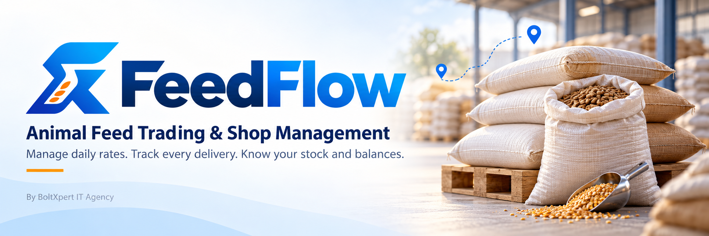

# FeedFlow — Animal Feed Trading & Shop Management Software

**Manage daily rates. Track every delivery. Know your stock and balances.**

FeedFlow brings Wanda animal-feed trading, customer orders, transport, inventory and accounts into one connected workspace for feed dealers and single-location shops.

[View Releases](https://github.com/boltxpert/feedflow-downloads/releases) · [Request a Demo](https://wa.me/923133454060?text=Hello%2C%20I%20would%20like%20a%20FeedFlow%20demo.) · [Licensing & Pricing](https://wa.me/923133454060?text=Hello%2C%20please%20share%20FeedFlow%20licensing%20and%20pricing%20details.)

**Windows Host** · **Windows & Android Clients** · **English & Urdu**

## From company rates to customer accounts

**Company Rates → Customer Demands → Batches & Bilties → Deliveries → Stock & Ledgers**

Keep purchase and selling rates, quantities, transport details and payments connected throughout your daily feed-business workflow.

| FeedFlow Host | FeedFlow Client |
| --- | --- |
| The central Windows application holds business records and provides the complete shop-management workspace. | Windows and Android applications connect authorized staff to the Host over the shop's local network. |

One active Host serves one business location. Devices are paired separately from user accounts, and permissions control each person's access.

## Features for everyday feed trading

- **Companies & products:** organize feed companies, customers and exact product variants by code, weight and type.
- **Daily rates & templates:** maintain dated rates, company discounts and transport/bilty inputs while preserving historical transaction rates.
- **Demands & batches:** group customer requirements into purchase batches and bilties, with driver, vehicle and transport details.
- **Delivery & stock control:** track deliveries, shortages, damage and returns; reconcile shop receipts and view stock movement history.
- **Counter & credit sales:** record walk-in or registered-customer sales, payments, charges and receipts against available stock.
- **Accounts & reporting:** customer/company ledgers, payments, expenses, operational reports and permission-controlled financial information.
- **Business safeguards:** role-based access, audit history, encrypted backup/restore, and English/Urdu interfaces with light/dark themes.

## Screenshots

| Business dashboard | Daily rates & templates |
| :---: | :---: |
| *Screenshot coming soon* | *Screenshot coming soon* |
| **Batches & delivery tracking** | **Inventory & customer accounts** |
| *Screenshot coming soon* | *Screenshot coming soon* |

<!-- Replace placeholders after uploading demonstration screenshots.
Suggested paths: screenshots/dashboard.png, screenshots/rate-templates.png,
screenshots/batches-deliveries.png, screenshots/inventory-accounts.png.
Hide customer phone numbers, financial details and private credentials.
-->

## Availability & getting started

**Public installers have not yet been published in this repository.**

[Check the release page](https://github.com/boltxpert/feedflow-downloads/releases) or [contact us for a demo and availability](https://wa.me/923133454060?text=Hello%2C%20please%20share%20FeedFlow%20demo%20and%20installation%20details.). Intended distributions are **Windows Host**, **Windows Client** and **Android Client**.

For setup, confirm your license, prepare the shop's Host computer, then pair staff devices on the same Wi-Fi/LAN and assign individual user accounts.

## Licensing, terms & responsible use

- **License-based software:** contact BoltXpert IT Agency for pricing, activation and the applicable agreement. This downloads repository does not grant an open-source license or source-code rights.
- **Agreed terms apply:** device allowances, license duration, support, renewal and any refunds must be confirmed in your quotation or agreement.
- **Local-network operation:** everyday business transactions run through the Host. When it is unavailable, authorized Client caches are read-only; Clients do not queue offline transactions. Initial license activation requires internet access.
- **Single-location scope:** remote cloud and multi-branch operation are not advertised as current capabilities.
- **Protect your business:** review rates, stock and financial records; maintain secure backups before updates or transfers. Contact support before uninstalling an app containing business data, and never post credentials or customer records publicly.

## Built by BoltXpert IT Agency

**Team Lead:** Asad Ullah · **Location:** Layyah, Pakistan

[WhatsApp: +92 313 3454060](https://wa.me/923133454060) · [Email: support@boltxpert.com](mailto:support@boltxpert.com)

**Bring clarity to your animal-feed shop. [Request a FeedFlow demo.](https://wa.me/923133454060?text=Hello%2C%20I%20would%20like%20a%20FeedFlow%20demo.)**
